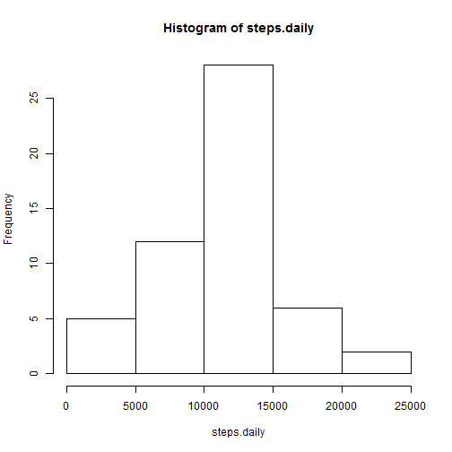
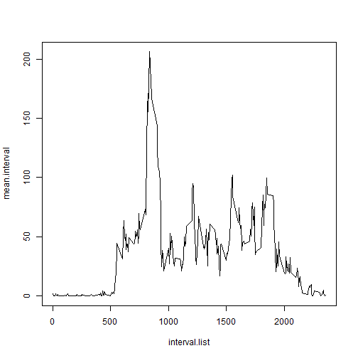
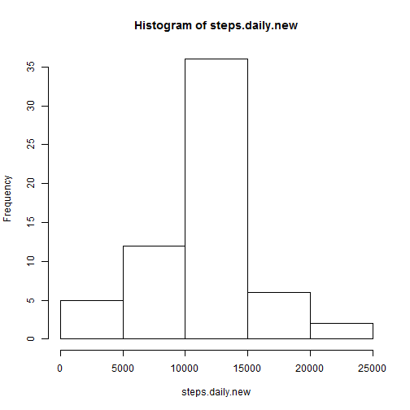
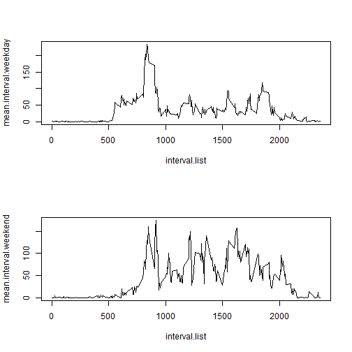

---
output:
  html_document:
    fig_height: 7
---
## Assignment 1

The **first part** of the code loads the data and adjusts the class of the **date** 
variable. Default class is factor, so I use strptime() function to convert it to 
POSIXlt.


```r
data<-read.csv("activity.csv",header=T)
data$date<-strptime(data$date,"%Y-%m-%d")
```

The **second part** of the code does the following:

- calculates total number of steps made each day, using tapply() function. I 
order for this function to work, variable **date** was converted to character
- number of steps per each day was stored in variable **steps.daily**
- histogram was plotted on **steps.daily**
- mean of **steps.daily** is calculated and printed
- median of **steps.daily** is calculated and printed


```r
steps.daily<-with(data,tapply(steps,as.character(date),sum))
hist(steps.daily)
```

 

```r
mean(steps.daily,na.rm=T)
```

```
## [1] 10766.19
```

```r
median(steps.daily,na.rm=T)
```

```
## [1] 10765
```

The **third part** of the code does the following:

- It calculates average number of steps per interval and stores them in 
**mean.interval**. 
- It also calculates **interval.list**, which finds unique values of intervals. 
- These are plotted in a line graph, where **interval.list** is on the x axis and 
**mean.interval** is on the y axis.
- The final part of the code returns the interval with the largest number of 
average steps. This is done by applying max() function on **mean.interval**, 
followed by match() function which locates this maximum in the **mean.interval** 
vector. This location was then applied to **interval.list** in order to find the 
appropriate interval.


```r
mean.interval<-with(data,tapply(steps,interval,mean,na.rm=T))
interval.list<-unique(data$interval)
plot(interval.list,mean.interval,type='l')
```

 

```r
interval.list[match(max(mean.interval),mean.interval)]
```

```
## [1] 835
```

The **fourth part** of the code does the following:

- First it calculates number of missing values in the entire dataframe. It then 
calculates that number for **steps** variable, which confirms that all NA values 
are located in this variable.
- It creates a new dataset, called **data.new** which is, at first, just 
duplicated **data**. Then, a 'for' loop is called, which iterates through **steps** 
variable and performes action for every NA value. It finds the appropriate 
interval for this value and then extracts the appropriate mean for that interval
from the **mean.interval** vector. This mean then replaces the NA value in 
**data.new** and the process is repeated until all the NA values are replaced. 
- Afterwards, **steps.daily.new** is calculated for new dataset and the histogram is 
plotted.
- In the end, the code calculates the mean and median for the **steps.daily.new** 
variable


```r
sum(is.na(data[1:3]))
```

```
## [1] 2304
```

```r
sum(is.na(data[1]))
```

```
## [1] 2304
```

```r
data.new<-data
for (i in 1:length(data.new[[1]])) {
          if (is.na(data.new[[1]][i])==T) {
               index<-match(data.new[[3]][i],interval.list)
               data.new[[1]][i]<-mean.interval[index]
          } 
}
steps.daily.new<-with(data.new,tapply(steps,as.character(date),sum))
hist(steps.daily.new)
```

 

```r
mean(steps.daily.new)
```

```
## [1] 10766.19
```

```r
median(steps.daily.new)
```

```
## [1] 10766.19
```

The effects of replacing NA values with interval means are minimal. Mean of 
number of steps per day remains the same, while the median has slighly increased
from 10765 to 10766.19 and became equal to the mean. The only impact is changing 
the distribution so that the histogram which was slighlty **skewed to the right** 
(mean>median) becomes **equally distributed** with respect to skeweness 
(mean = median). 

The effect is so small due to the following: NA values occur for entire days 
without measurements. Therefore replacing NAs with appropriate interval means 
results with the same number of steps for each day that contains NA 
cells - 10,766.19, which is the mean of **steps.daily**. Therefore, just inserting 
these numbers does not affect the mean, while it causes median to change slighly
and become equal to the mean.


The **fifth part** of the code does the following:

- It adds the new column to the dataset called weekday, which contains the 
weekday for each date.
- This column is then transformed so that the value changes to Weekday if the 
day in question is a weekday or to Weekend if the day is weekend.
- Afterwars, 2 new datasets are created by subsetting, one encompassing only the
weekdays and the other only weekends.
- Means of number of steps for each interval are calculated for each dataset.
- In the end, the code plots **interval.list** to the means per interval and these
plots are presented in a panel for the two datasets.


```r
data$weekday<-weekdays(data$date)
day<-c('Monday','Tuesday','Wednesday','Thursday','Friday')
data$weekday[data$weekday %in% day]<-'Weekday'
data$weekday[data$weekday %in% c('Saturday','Sunday')]<-'Weekend'
df.weekday<-subset(data,data$weekday=="Weekday")
df.weekend<-subset(data,data$weekday=="Weekend")
mean.interval.weekday<-with(df.weekday,tapply(steps,interval,mean,na.rm=T))
mean.interval.weekend<-with(df.weekend,tapply(steps,interval,mean,na.rm=T))
par(mfrow=c(2,1))
plot(interval.list,mean.interval.weekday,type='l')
plot(interval.list,mean.interval.weekend,type='l')
```

 
